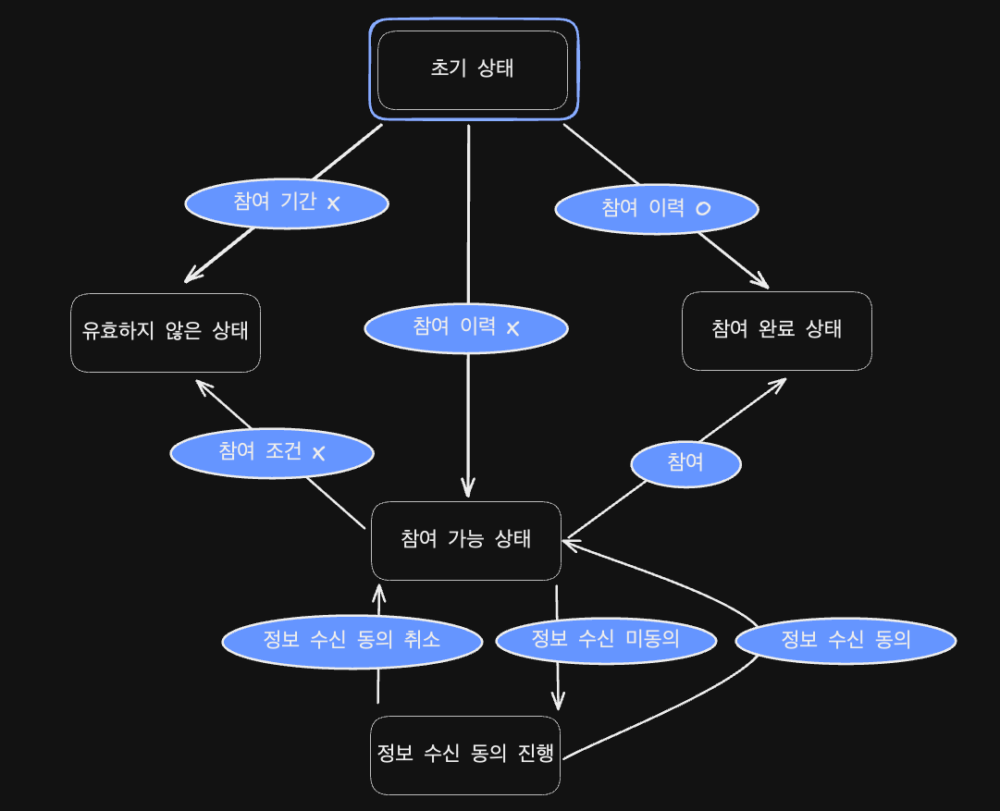
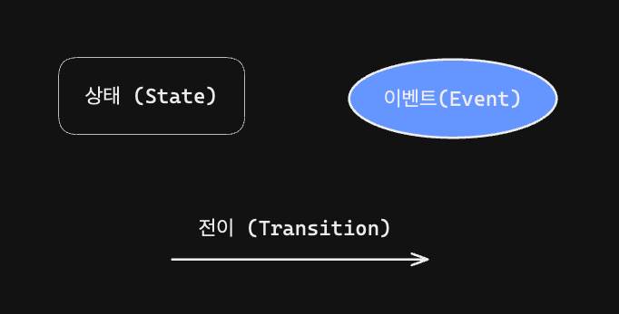
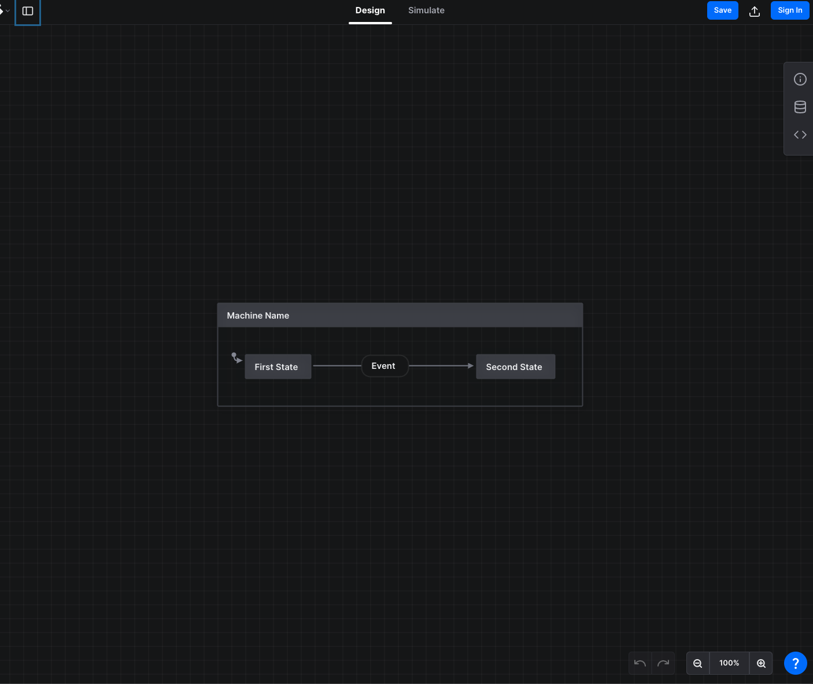

# 상태를 치료해줄 사람 어디 없나!

## ~~가만히 놔두다간 끊임없이 덧나...~~

김성백


---

## 평화롭던 어느날 ... 누군가 날 찾아왔다...

특정 프로모션 전용 페이지를 만들 때마다 매번 개발자에게 부탁하는 것이 리소스 낭비같아요!

이번 기회에 요구사항 정리해서 템플릿처럼 사용할 수 있게 해보면 어떨까요?

---

## 요구사항은 다음과 같아요!

> 필요한 데이터는 동기적인 함수 호출로 얻을 수 있다 가정합니다.

- 참여 기간 O
- 기존 참여 이력 X
- 참여 대상 조건 O
- 정보 수신 동의 O

위 조건을 모두 만족하는 유저만 참여 가능!



---

## 유한 상태 머신 (Finite State Machine, FSM)

- 한 번에 오로지 한 개의 **상태**만을 가지게 된다.
- 현재 상태(Current State)란 임의의 주어진 시간의 상태를 의미한다.
- 특정 **이벤트**(Event)에 의해 하나의 상태에서 다른 상태로 변화할 수 있다.
- 하나의 상태에서 다른 상태로 변화하는 것을 **전이**(Transition)이라 한다.




---

## 한 번에 오로지 하나의 상태만을 가지게 된다.

- 초기 상태
- 유효하지 않은 상태
- 참여 가능 상태
- 참여 완료 상태
- 정보 수신 동의 진행 상태


---

## 특정 이벤트(Event)에 의해 다른 상태로 전이(Transition) 가능

- **[참여 기간 X]**
  초기 상태 -> 유효하지 않은 상태
- **[참여 이력 O]**
  초기 상태 -> 참여 완료 상태
- **[참여 이력 X]**
  초기 상태 -> 참여 가능 상태
- **[참여 조건 X]**
  참여 가능 상태 -> 유효하지 않은 상태 
- ...


---

## 리듀서(Reducer)

> 현재 상태(Current State)와 액션(Action) 객체를 전달받아 새로운 상태를 반환하는 순수 함수

- Action -> Event

- Reducer -> Transition

---

## 상태 (State)

```typescript
type State =
  | 초기_상태
  | 유효하지_않은_상태
  | 참여_가능_상태
  | 참여_완료_상태
  | 정보_수신_동의_진행_상태;

type 초기_상태 = {
  status: "초기";
};

type 유효하지_않은_상태 = {
  status: "유효하지 않음";
};

type 참여_가능_상태 = {
  status: "참여 가능";
};

type 참여_완료_상태 = {
  status: "참여 완료";
};

type 정보_수신_동의_진행_상태 = {
  status: "정보 수신 동의 진행";
};

```


---

## 액션 (Action)

```typescript
type Action =
  | { type: "참여 기간 X" }
  | { type: "참여 이력 O" }
  | { type: "참여 이력 X" }
  | { type: "참여 조건 X" }
  | { type: "참여" }
  | { type: "정보 수신 동의 취소" }
  | { type: "정보 수신 미동의" }
  | { type: "정보 수신 동의" };
```


---

## 리듀서 (Reducer)

```typescript
const reducer = (state: State, action: Action): State => {
  switch (action.type) {
    case "참여 기간 X":
      return { status: "유효하지 않음" };
    case "참여 이력 O":
      return { status: "참여 완료" };
    case "참여 이력 X":
      return { status: "참여 가능" };
    case "참여 조건 X":
      return { status: "유효하지 않음" };
    ...
  }
};
```


---

## 하지만 아직 아쉬운 점이 존재합니다.

현재 상태가 어떤 상태인지는 고려하지 않고

액션만을 이용해 새로운 상태를 만들어내기 때문!

ex) [초기 상태] -> [정보 수신 동의 진행]로의 전이가 가능한 상황

--- 

## Redux Style Guide

> Treat Reducers as State Machines

```typescript
const reducer = (state: State, action: Action): State => {
  switch (state.status) {
    case "초기":
      return 초기_상태_Reducer(state, action);
    case "유효하지 않음":
      return 유효하지_않은_상태_Reducer(state, action);
    case "참여 가능":
      return 참여_가능_상태_Reducer(state, action);
    ...
  }
};

const 참여_가능_상태_Reducer = (
  state: 참여_가능_상태,
  action: Action
): State => {
  switch (action.type) {
    case "참여 조건 X":
      return { status: "유효하지 않음" };
    case "참여":
      return { status: "참여 완료" };
    case "정보 수신 미동의":
      return { status: "정보 수신 동의 진행" };
    default:
      return state;
  }
};
```


---

## 그렇다면 이제 어떻게 액션을 전달할 것인가?

> 1. 값을 이용해 자동으로 전이시켜야 한다면 `useEffect` 
> 2. 사용자의 인터랙션을 이용해 상태를 전이시킨다면 이벤트 핸들러

---

```typescript
declare const 참여_가능_여부: boolean;
declare const 정보_수신_동의_여부: boolean;

useEffect(() => {
  if (state.status !== "참여 가능") return;

  if (!참여_가능_여부) {
    dispatch({ type: "참여 조건 X" });
    return;
  }

  if (!정보_수신_동의_여부) {
    dispatch({ type: "정보 수신 동의 진행" });
  }
}, [state.status]);

```


---

## 리듀서만을 이용해 상태 머신을 관리하기란 힘듭니다...😅

1. 리듀서는 순수(Pure)하지만 새로운 상태로 전이를 유발시키기 위한 로직은 여전히 복잡하며, 코드의 실행 순서를 고려해야 합니다.

2. 각각의 `useEffect`에 대해 올바른 상태에 대해서만 처리하고 있는지 매번 검증해주어야 합니다.

3. 여기에 비동기 상황까지 처리해야 한다면 .... ? 😱

---

## 상태 머신 관리 라이브러리(XState)를 고려해보자!
> 물론 저 역시 아직 도입은 못했습니다만.... 🥲
> 열심히 준비 중이에요...!

---

## 그 전에 헷갈리지 않도록 용어 정리부터 하고 갑시다.

---

## Action on State Machine

> 이벤트가 send(`dispatch`)되면 상태 머신은 I/O, 함수 호출, 상태 변경 등의 작업(Action)을 수행한다.

리듀서에서는 이벤트(Event)의 개념을 액션(Action)이라는 이름으로 사용.

But, 상태 머신에서의 액션은 전이(Transition)의 결과로 발생하는 Side Effect를 의미한다.

상태 머신에서의 액션은 방금 발생한 것(Event)이 아닌 수행해야 하는 것(Command)을 제시하는 것!

---

## Action on State Machine

- **이벤트(Event)**
  발생한 일을 설명하며 상태 전이를 트리거시킨다.

- **액션(Action)**
  상태 전이에 대한 응답으로써 발생해야 하는 Side Effect를 설명한다.

---

## Context on State Machine

상태(State)와 구분되는 부가적인 데이터는 컨텍스트(Context)에 저장

컨텍스트를 가지는 경우 확장된 상태(Extended State)라고 표현하기도 한다.

```typescript
type State = {
  status: "초기" | "유효하지 않음" | ...,
  context: {
    참여_기간_여부: boolean;
    정보_수신_동의_여부: boolean;
    참여_조건_만족_여부: boolean;
    참여_이력_존재_여부: boolean;
    정보_수신_동의_여부: boolean;
  },
};
```


---

### 초기 상태를 명시

```typescript
const machine = createMachine(
  {
    id: "promotion",
    initial: "초기",
    context: {
      참여_가능_여부: true | false;
      정보_수신_동의_여부: true | false;
      ...
    }
  }
);
```


---

### 존재할 수 있는 상태들을 나열

```typescript
const machine = createMachine(
  {
    ...,
    states: {
      "초기": {},
      "유효하지 않음": {},
      "참여 완료": {},
      "참여 가능": {},
      "정보 수신 동의 진행": {}
    }
  }
);
```


---

### 각 상태가 수신할 수 있는 이벤트를 명시
> 중첩 리듀서를 작성할 필요 X

```typescript
const machine = createMachine(
  {
    ...,
    states: {
      ...,
      "참여 가능": {
        on: {
          참여: {
            target: "참여 완료"
          },
          "정보 수신 미동의": {
            target: "정보 수신 동의 진행"
          }
        }
      },
      ...
    }
  }
);
```


---

## 가드 (Guard)

사용자가 명시적으로 이벤트를 발생시킨 경우가 아닌 때에

참여 기간 여부, 참여 이력 여부, 참여 조건 여부 등의 조건을 이용해 자동으로 상태를 전이시킬 수 있어야 한다.

특정 상태로 전이 되었을 때 **상황**에 따라 다른 상태로 전이시킬 수 있는 이벤트!

이러한 상황을 판단하는 함수가 바로 가드(Guard)


---

### 상황에 맞게 자동으로 전이되도록!

```typescript
const machine = createMachine(
  {
    ...,
    states: {
      "초기": {
        always: [
          { target: "유효하지 않음", cond: "참여 기간 X" },
          { target: "참여 완료", cond: "참여_이력_O" },
          { target: "참여 가능", cond: "참여_이력_X" }
        ]
      }
    },
  },
  {
    guards: {
      "참여 기간 X": (context) => !context.참여_기간_여부,
      "참여_이력_O": (context) => context.참여_이력_존재_여부,
      "참여_이력_X": (context) => !context.참여_이력_존재_여부
    }
  }
)
```


---

### 가드를 활용하면 `useEffect` 내의 복잡한 분기처리는 사라지게 됩니다.

```typescript
declare const 참여_기간_여부: boolean;
declare const 참여_이력_존재_여부: boolean;

useEffect(() => {
  if (state.status !== "초기") return;

  if (!참여_기간_여부) {
    dispatch({ type: "참여 기간 X" });
    return;
  }

  if (!참여_이력_존재_여부) {
    dispatch({ type: "참여_이력_X" });
  } else {
    dispatch({ type: "참여_이력_O" });
  }
}, [state.status]);
```


---

## 비동기 상황은 어떻게 처리하나요?
> 다시 한번 `useEffect`... 혹은 서비스(Service)를 활용하면 됩니다.

```typescript
const Component = () => {
  const { data, error } = useSWR('/api/user', fetcher);

  const [state, send] = useMachine(machine);

  useEffect(() => {
    send({
      type: 'DATA_CHANGED',
      data,
      error
    });
  }, [data, error, send]);

  return ...
};
```

---

## 정리

- 학술적인 내용이 많아 러닝 커브가 높지만 상태 관리가 복잡한 경우라면 충분히 유용하게 사용할 수 있는 라이브러리라고 생각함.

- 상태와 데이터를 분리해서 생각하도록 강제하는 점 / 어떤 상태가 존재해야 하는 지 먼저 설계해야 하는 점이 굉장히 신선하였음.

- StateCharts를 이용한 문서화
  피그마 상의 화면 상태와 Sync 등
  다양하게 활용이 가능할 것 같음!



---

# 감사합니다 🙇‍♂️

