# 디자인을 바라보는 개발자의 시선 with Figma

김성백

<!-- 이미 다 아는 내용일 수도 있고 너무 당연한 얘기를 한다고 생각할 수도 있지만 -->
<!-- 피그마를 단순히 보기만 하던 뷰어(Viewer)의 입장에서 기능들을 하나하나씩 알아가며 -->
<!-- 사용해보는 유저(User)가 되어보니 어떠한 방식으로 요청을 해야 하고 -->
<!-- 어떻게 디자인이 되어 있을 때 개발하기 편하다고 느꼈는 지를 분명히 알게 된 것 같아서 -->
<!-- 용기 내어 전체 세미나 때 발표를 진행해보게 되었습니다. -->

---

## 디자인과 개발은 요소를 배치하는 관점이 약간 다릅니다.

- 디자인은 **절대 좌표**를 기준으로 이동시키면서 컨테이너에 요소를 얹는 방식
- 개발은 요소 간의 **상대 좌표**와 컨테이너 ↔️ 요소 혹은 요소 ↔️ 요소 간의 **관계**를 기준으로 컨테이너 내에 요소가 포함되는 방식
- 아직은 잘 이해가 안되시죠? 차근차근 설명해 드리겠습니다 🫡

---

## 절대 좌표

- 프레임
  - 디바이스(또는 브라우저)

- **relative**
  - 절대 좌표의 기준이 된다.

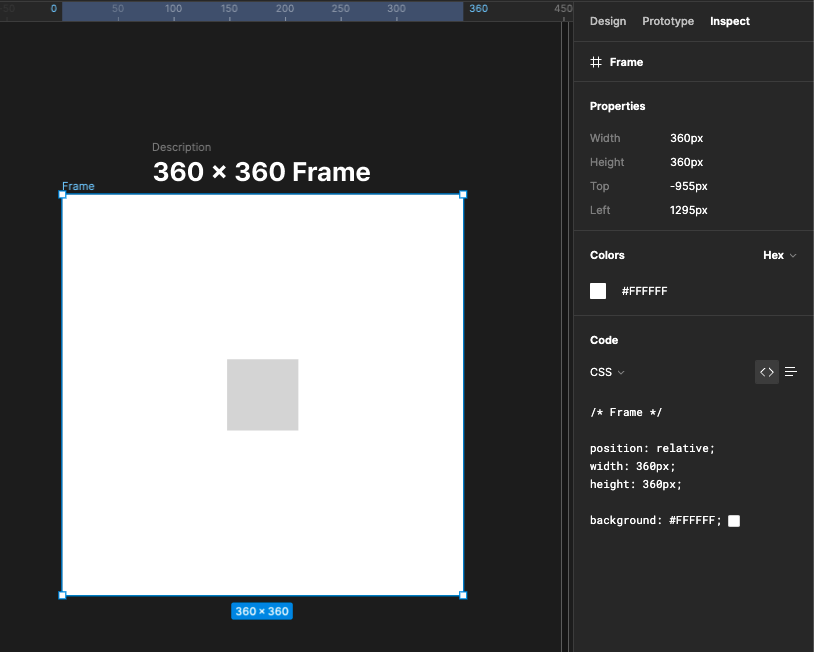

<!-- 먼저 피그마의 미리 정의한 360 x 360 프레임을 디바이스 혹은 브라우저라고 생각해주세요. -->
<!-- 그리고 우측 패널에 있는 CSS 속성 중 position: relative가 적용되어 있다면 해당 프레임이 자식 요소가 절대 좌표로 설정할 기준점이 되어 준다고 생각해주시면 됩니다.  -->

---


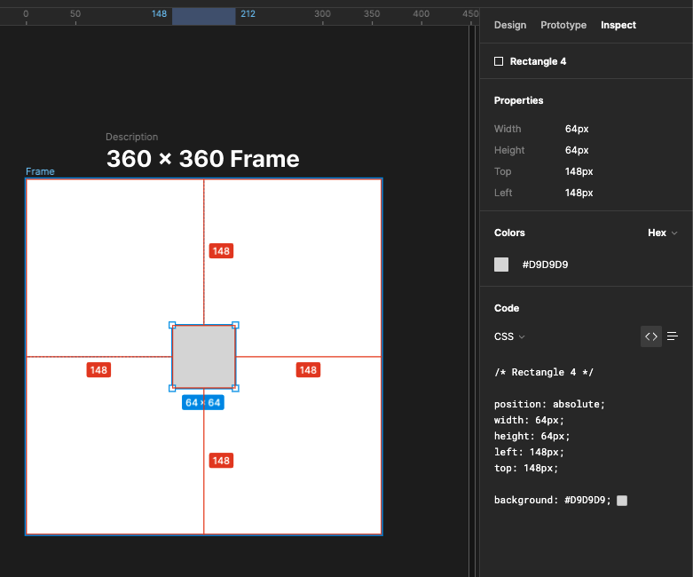

- **absolute**
  - 기준으로 삼은 요소에 대해 특정 거리만큼 띄운다. 

- 프레임(relative)을 기준으로 사각형을 위에서 148px, 왼쪽으로 148px 만큼 떨어져 있음을 의미.

<!-- 여기서는 프레임 내부의 사각형에 CSS 속성 position: absolute가 적용되어 있는 것을 보실 수 있을 거에요. -->
<!-- 따라서 간단하게 말하면 프레임의 (0, 0)을 기준으로 사각형을 위에서 148 왼쪽으로 148만큼 띄운다라고 이해해주시면 됩니다.  -->

---

## 알려준 대로 개발해보기!

> 이해를 돕기 위한 가상의 코드입니다.

```html
<Frame 
  css={
    position: relative;
    width: 360px;
    height: 360px;
  }
>
  <Rectangle 
    css={
      position: absolute;
      width: 64px;
      height: 64px;
      left: 148px;
      top: 148px;
    }
  >
</Frame>
```

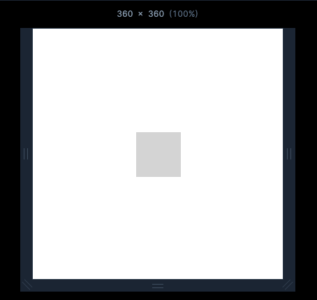

<!-- 그렇다면 우선 피그마가 알려준대로 개발해볼게요. -->
<!-- 여기서는 이해를 돕기 위해 리액트 코드와 비슷한 가상의 코드를 정의해보았습니다.  -->
<!-- 먼저 프레임에 position: relative를 설정하여 절대 좌표의 기준으로 삼았고 -->
<!-- 프레임 내부의 사각형에 position: absolute를 설정해서 기준점으로부터 얼마만큼 떨어져 있는지 정의하게 
됩니다.  -->
<!-- 그러면 이제 360 x 360 프레임 내에서 디자인 대로 잘 구현이 된 것을 확인하실 수 있을거에요.  -->

---

개발 별거 없네 ... ? 

## 피그마가 알려주는 대로만 하면 되잖아! 😄

---

🤖: 피그마 그대로 만들었습니다.

🧚‍♀️: 어...? 화면이 변화해도 가운데에 위치시켜주세요! (~~딱 보면 알아서 했어야지...~~)

🤖: 수정할게요! (~~피그마에 표현을 해놨어야지 ...~~)

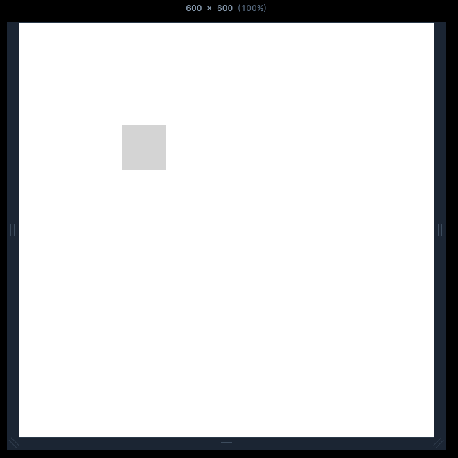

---

디자이너 입장에서는 본인의 의도가 반영되지 않았고

개발자는 추가로 작업을 하게 되었어요 ...

## 그렇다면 왜 이런 일이 일어나는 걸까?

---

## 개발에서는 절대 좌표를 지양하기 때문!


> 앞서 본 것처럼 절대 좌표를 사용할 수도 있긴 합니다만
> 기본적으로는 부모(컨테이너) 또는 형제 요소와의 관계를 기준으로 요소를 배치합니다.

<!-- 물론 앞에서 피그마가 제공해 준 CSS를 그대로 사용하여 절대 좌표 기준으로 개발을 진행할 수도 있습니다만 ... -->


---

## 개발에서는 절대 좌표를 지양하기 때문!

### 성능 관점
- 위치를 계산하기 위한 추가적인 연산이 필요

---

## 개발에서는 절대 좌표를 지양하기 때문!

### 성능 관점
- 위치를 계산하기 위한 추가적인 연산이 필요

### 작업 효율 관점

- $x \times y$ 개만큼의 디자인이 필요

---

## 개발에서는 절대 좌표를 지양하기 때문!

> 1. 위치를 계산하기 위한 추가적인 연산이 필요 (성능)
> 2. $x \times y$ 개만큼의 디자인이 필요 (효율)

성능에 관한 문제는 개발자들의 숙제...😂로 남겨두도록 하고

우선은 작업 효율 측면에 대해서만 바라보도록 하죠!

---

## 브라우저(기기)의 화면 크기는 변할 수 있습니다.

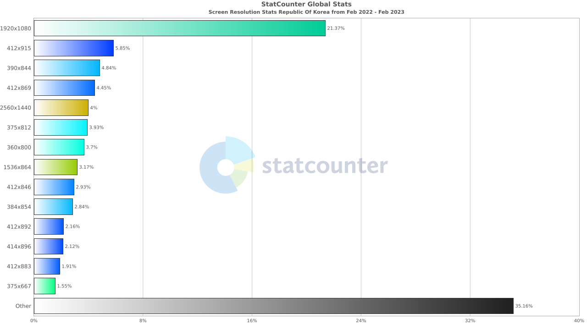

<!-- 우선 지난 한달 동안 브라우저 또는 화면 크기의 점유율을 보여주는 차트입니다. -->
<!-- 여기서 중요한 점은 바로 우리가 만든 서비스에 접근하는 기기의 사이즈는 정말로 다양하고 변화할 수 있다는 점이에요. -->

---

## 브라우저(기기)의 화면 크기는 변할 수 있습니다.

**절대 좌표를 기준**으로 $x \times y$ 크기의 화면을 대응해야 한다면 

**절대 좌표를 기준**으로 디자인된 $x \times y$개의 프레임이 필요하게 됩니다.

#### ~~우선 저는 개발 못할 것 같아요 🫠~~ 

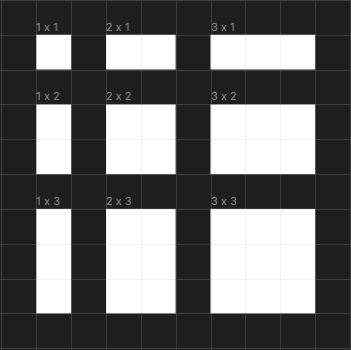

<!-- 따라서 변화할 수 있는 화면 크기에 대응 하기 위해서는 절대 좌표 기준으로 개발하게 된다면 -->
<!-- 대응하고자 하는 화면 크기에 대한 모든 디자인을 정의하고 개발해야 해요. -->

---

## 좌표보단 흐름과 정렬로 표현

- 변화할 수 있는 모든 크기에 대해 절대 좌표로 모두 대응하는 것은 너무나 **비효율적!**

- 프레임의 크기가 변할 때마다 요소가 알아서 자리를 찾아가도록 구현!

### 어떻게? 흐름과 정렬을 이용해서!

- 좌표 대신 흐름과 정렬을 이용해서 표현하게 되면 화면이 늘어났을 때 **의도대로 화면이 변하게끔 유도**합니다.

- 즉, 변화할 수 있는 모든 화면에 **대응**하는 방법을 알려주는 것!

- 물고기(좌표)를 잡아주지 말고, 물고기(좌표)를 잡는 방법을 알려주자

---

## 흐름

일반적으로 요소들은 부모(프레임) 내부에서 가로 방향으로 배치되거나 세로 방향으로 배치됩니다.

```css
.frame {
  display: flex;
  flex-direction: {row | column}
}
```

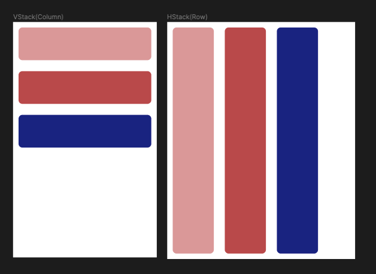


<!-- 그렇다면 흐름은 무엇일까요? -->
<!-- 흐름이란 요소들이 부모 내부에서 어떠한 방향으로 배치될 지를 정의하는 것이라 생각해주시면 됩니다. -->
<!-- 일반적으로 가로 방향으로 배치되거나 세로 방향으로 배치되는 데, 이러한 형태를 가로 방향의 경우 HStack 혹은 Row, 세로 방향의 경우 VStack 혹은 Column이라고 부르게 됩니다. -->
---

## 정렬

부모(프레임) 내부에서 자식 요소들이 어느 위치에 배치될 것인지를 설정

- TOP-LEFT
- TOP-CENTER
- TOP-RIGHT
- CENTER
- ...etc


---

## 박스 모델 (Box Model)

개발에서는 모든 요소들을 상자 형태의 영역으로 바라봅니다.

따라서 디자인 자체를 콘텐츠를 담을 상자 형태의 영역으로 정의하고

그 외 속성들을 이용하여 위치나 정렬 그리고 스타일을 지정하는 것이라 할 수 있어요!

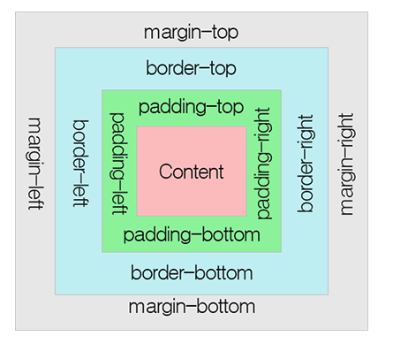

<!-- 흐름과 정렬 외에도 추가적으로 박스 모델이라는 개념이 존재해요! -->
<!-- iOS, 안드 개발에서도 통용되는 개념인지는 모르겠지만 웹에서는 모든 것을 상자 형태의 영역으로 바라보게 됩니다. -->


---

이미 너무 많은 힌트를 드린 것 같지만 

결국 제가 말하고자 하는 핵심은 

디자인과 개발의 간극을 메울 수 있는

## **오토 레이아웃을 적극 활용하자!** 입니다.

---

## 왜 오토 레이아웃을 사용해야 하죠?

### 디자인과 개발이 동일한 관점으로 디자인을 바라볼 수 있게 됨. 

---

## 왜 오토 레이아웃을 사용해야 하죠?

- 디자인과 개발이 동일한 관점으로 디자인을 바라볼 수 있게 됨. 
### 디자인 입장에서는 개발자의 주관이 개입될 여지 없이 본인의 의도를 분명히 전달할 수 있음.

---

## 왜 오토 레이아웃을 사용해야 하죠?

- 디자인과 개발이 동일한 관점으로 디자인을 바라볼 수 있게 됨. 
- 디자인 입장에서는 개발자의 주관이 개입될 여지 없이 본인의 의도를 분명히 전달할 수 있음.

### 개발 입장에서도 디자인을 개발로 옮기기가 수월함.

---
## 왜 오토 레이아웃을 사용해야 하죠?

- 디자인과 개발이 동일한 관점으로 디자인을 바라볼 수 있게 됨. 
- 디자인 입장에서는 개발자의 주관이 개입될 여지 없이 본인의 의도를 분명히 전달할 수 있음.
- 개발 입장에서도 디자인을 개발로 옮기기가 수월함.
### 알잘딱깔센? 🤔 잠시 넣어두고 **정확하게 요청하고 그대로 빠르게 구현**하자!

---

## 왜 오토 레이아웃을 사용해야 하죠?

- 디자인과 개발이 동일한 관점으로 디자인을 바라볼 수 있게 됨. 
- 디자인 입장에서는 개발자의 주관이 개입될 여지 없이 본인의 의도를 분명히 전달할 수 있음.
- 개발 입장에서도 디자인을 개발로 옮기기가 수월함.
- 알잘딱깔센? 🤔 잠시 넣어두고 **정확하게 요청하고 그대로 빠르게 구현**하자!

### 결국 우리의 목표는 

- 개발자가 디자인을 해석하는데 드는 비용 ⬇️ 
- 디자이너의 의도를 반영하기 위해 드는 추가적인 커뮤니케이션 비용 ⬇

**이 두가지를 통해 빠르게 아이디어를 실현하는 것이니까요!**


---

# 그러면 개발자는 어떻게 디자인을 해석하나요?

---

## 개발자가 디자인을 해석하는 과정

프레임에 오토 레이아웃이 적용되어 있지 않더라도 오토 레이아웃이 적용되었다 생각합니다.

좌표보다는 흐름과 정렬을 기준으로 생각하기 때문이죠!

거기에 패딩(padding)을 사용하기 위함이에요!


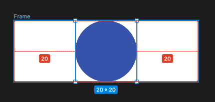

<!-- 이때 개발자가 동일한 디자인을 해석하는 방법은 여러 가지가 있을 수 있어요. -->
<!-- 즉, 개발자에 따라 다르게 해석할 수 있는 여지가 있다는 것이죠! -->

---

## 1. 패딩을 이용하는 방법

- 좌우 패딩을 설정

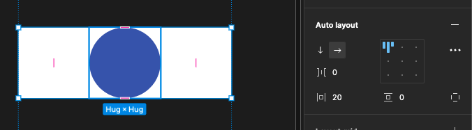


---

## 2. 정렬 모드를 이용하는 방법

- TOP-CENTER
- CENTER
- BOTTOM-CENTER


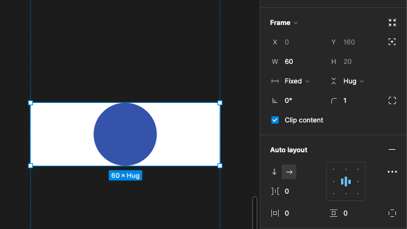


---

## 3. 영역만 차지하는 요소(Spacer)를 이용하는 방법

> 요소 간 간격(gap)이 일정하지 않은 경우에도 유용하게 사용 가능!

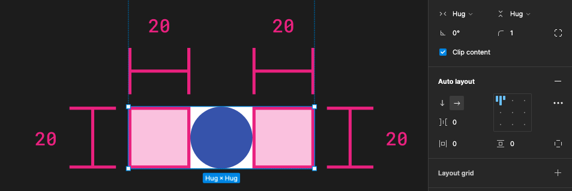


---


이외에도 다양한 구성 방법이 존재할 수 있지만

## 그래도 오토 레이아웃이 적용되어 있다는 것을 보장할 수 만 있다면

## 디자인 ➡ 코드로의 변환이 쉽게 가능해집니다.


---

## 1. 패딩을 이용하는 방법

```html
<AutoLayout
  layout={horizontal}
  paddingLeft={20}
  paddingRight={20}
>
  <Circle>
</AutoLayout>
```


---

## 2. 정렬 모드를 이용하는 방법

```html
<AutoLayout
  layout={horizontal}
  align={CENTER}
  width={60}
>
  <Circle>
</AutoLayout>
```


---

## 3. 영역만 차지하는 요소(Spacer)를 이용하는 방법

```html
<AutoLayout
  layout={horizontal}
>
  <Spacer width={20} height={20}>
  <Circle>
  <Spacer width={20} height={20}>
</AutoLayout>
```


---

## 디자인 ➡ 코드로의 전환이 쉽다는 것은

## 보다 빠르게 개발할 수 있음을 의미해요! 

# 왜냐구요? 


---


## 겉보기에는 똑같아 보일지 몰라도

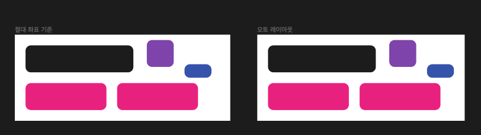

---

## 개발자가 체감하기에는 어마어마한 차이가 있답니다 ..! 😃 

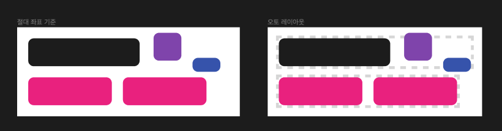

---

## 디자인이 박스 모델과 동일한 형태로 구성되어 있다면...!

어떻게 상자의 위치나 크기를 설정할지 고민하지 않아도 되니까요!

이는 더 이상 개발자가 $11-4=7$과 같은 계산을 일일히 하지 않아도 된다는 것을 의미해요 ...! 👍


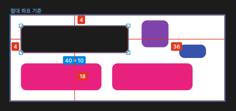
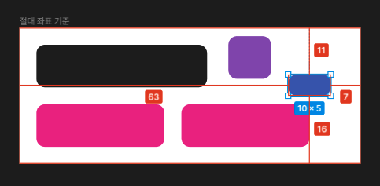

<!-- 만약 다음과 같이 오토 레이아웃을 이용해 디자인을 표현한다면 -->
<!-- 모든 것을 상자 형태로 바라보는 개발자 입장에서는  -->
<!-- 어떻게 상자를 구성해야 할지 고민하지 않아도 된다는 것을 의미합니다. -->

---

추가로 어떤 형태로 구성이 되든 오토 레이아웃을 사용하여 디자인을 구성한다면

디자이너와 개발자가 동일한 방식으로 **디자인을 바라보고 있다는 것은 보장**할 수 있습니다!

디자인이 변경되더라도 이를 코드로 변경하면 그만이기 때문에 대응하는 속도가 빨라지는 것은 물론이구요 👍


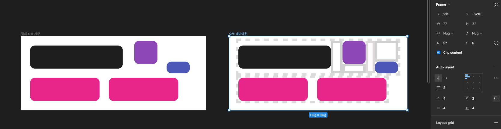

---

# 결론

## 디자인을 바라보는 개발자의 관점과 디자이너의 관점을 맞추자!

<!-- 앞으로 프로젝트를 진행하면서 서로의 영역을 너무 구분하거나  -->
<!-- 서로의 영역을 잘 모른다는 이유로 피드백이나 요청을 안하기 보다는 서로의 관점이 차이가 있을 수 있겠다 이해하고 -->
<!-- 그에 맞게 피드백과 요청을 할 수 있는 것이 매쉬업에 더 좋은 문화라 생각해 발표를 준비하게 되었습니다. -->

---

# 끝!

감사합니다.
