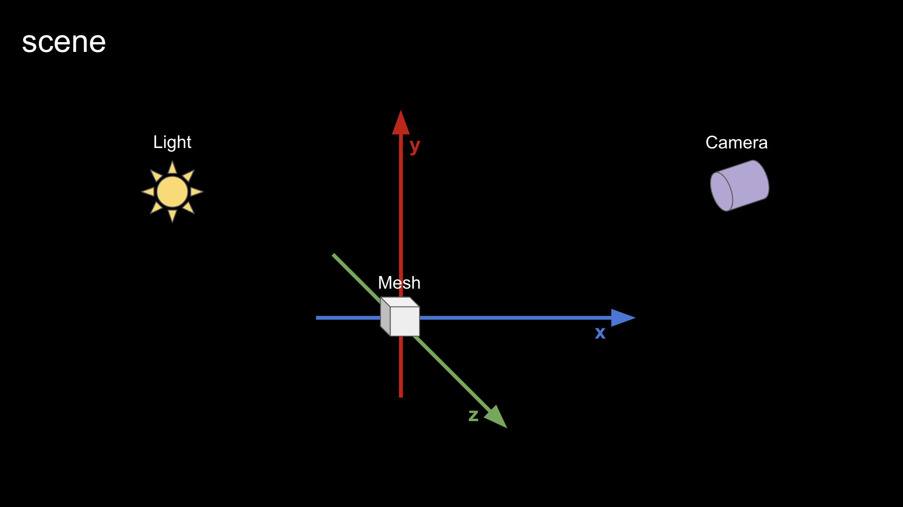
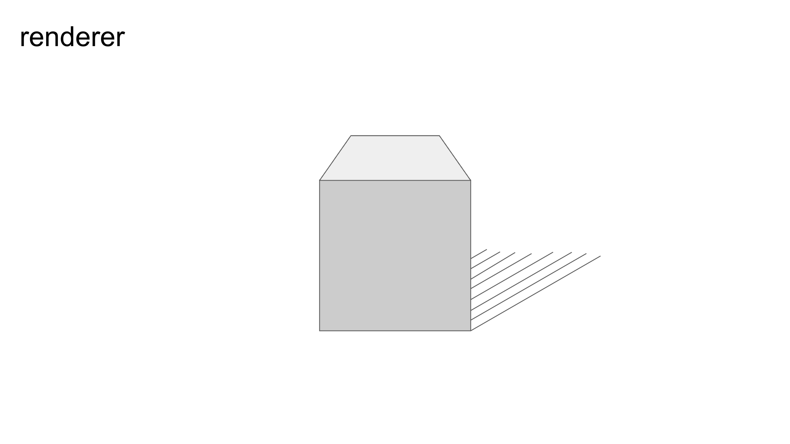
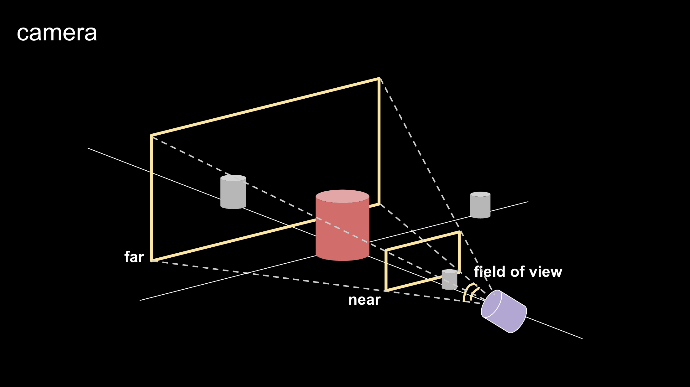
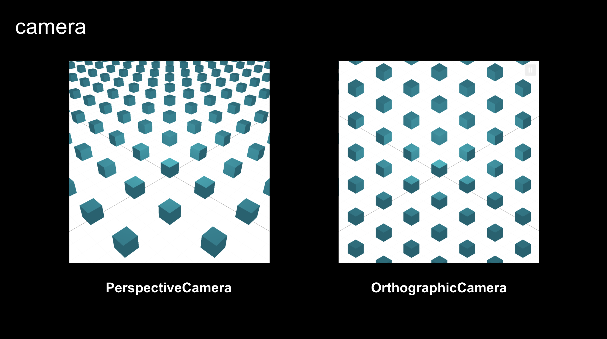
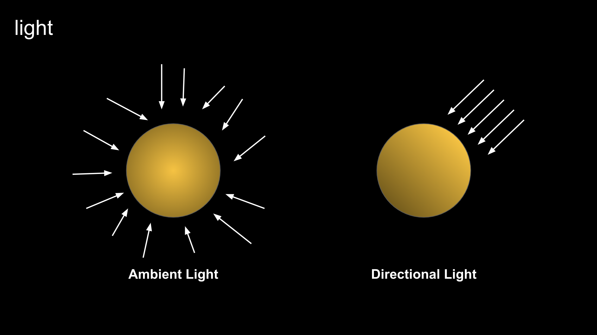
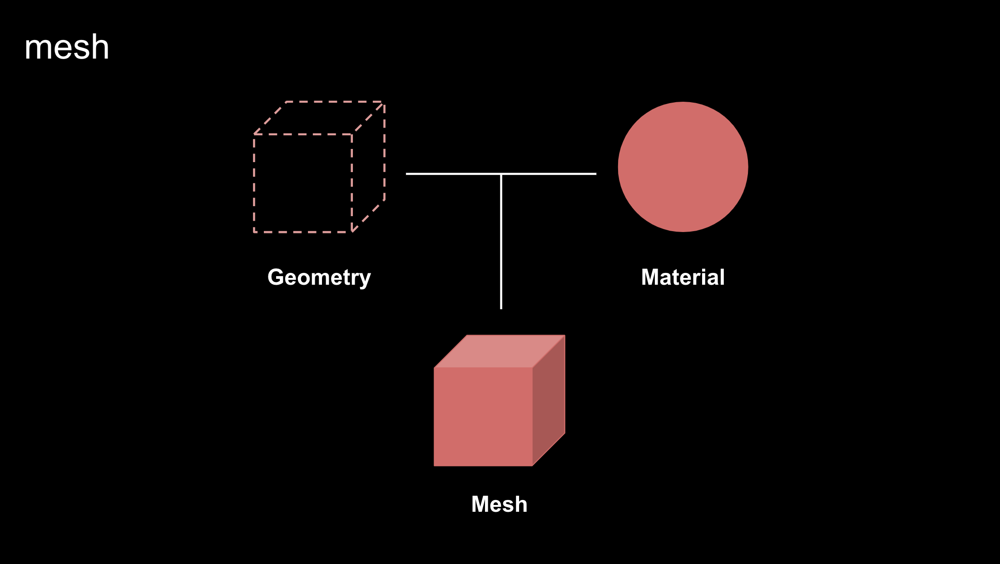
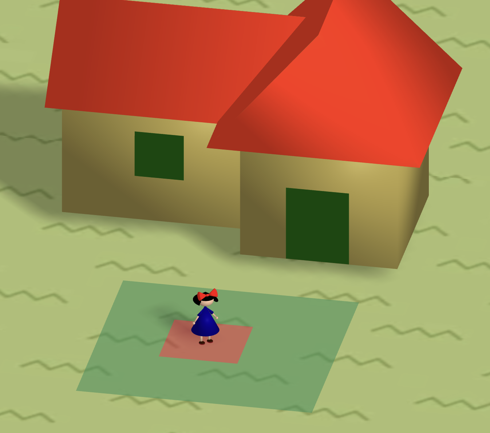

# kiki's delivery service (three.js)

염혜선

---

## WebGL

- Web graphics library
- 웹 브라우저에서 2D 및 3D 그래픽을 렌더링하기 위한 API
- GPU를 이용하여 빠른 처리 속도와 고품질의 그래픽 가능
- 병렬 처리 지원하여 빠른 처리 속도 보장
- 렌더링된 결과를 캐시에 저장하여 빠른 속도 보장

아쉬운 점

- 크로스 브라우징 이슈
- 높은 수준의 개발자 숙련도 필요하여 개발 비용과 시간을 증가시킬 수 있음

---

## three.js

- WebGL을 이용하여 3D 그래픽을 렌더링하기 위한 JavaScript 3D 라이브러리
- 일련의 API와 기능 제공하여 쉽게 사용 가능
- 크로스 플랫폼 지원
- 3D 그래픽을 생성하기 위한 다양한 기능 제공 (3D 모델링, 애니메이션, 카메라 등)
- 커뮤니티 및 문서화

---

## 구성 요소

### - scene



### - renderer



```javascript
/** 01. renderer: 화면에 그림을 그려주는 역할 */
// 1. dom에 직접 추가하는 방식
const renderer = new THREE.WebGLRenderer();
// renderer 사이즈를 윈도우의 풀 사이즈로 세팅
renderer.setSize(Window.innerWidth, window.innerHeight);
// renderer.domElement는 renderer가 가지고 있는 캔버스 element
document.body.appendChild(renderer.domElement);

// 2. 캔버스를 html에 작성해두고 가져오는 방식
const canvas = document.getElementById("three-canvas");
const renderer = new THREE.WebGLRenderer({
  canvas,
});
renderer.setSize(window.innerWidth, window.innerHeight);
```

```javascript
/** 02. scene: 전체 요소들이 포함되는 공간 */
const scene = new THREE.Scene();
```

### - camera

- PerspectiveCamera
- OrthographicCamera




```javascript
/** 03. camera */
// 1. PerspectiveCamera 원근 카메라 (사람의 눈으로 보는 방식을 모방)
const camera = new THREE.PerspectiveCamera(
  75, // 시야각
  window.innerWidth / window.innerHeight, // 종횡비 (화면의 너비/화면의 높이)
  0.1, // 보이는 최소 거리
  1000 // 보이는 최대 거리
);
// 카메라 위치 설정
camera.position.x = 1; // 1m 라고 가정
camera.position.y = 2; // 2m 라고 가정
camera.position.z = 5; // 5m 라고 가정
// 씬에 카메라 추가
scene.add(camera);
```

```javascript
// 2. OrthographicCamera 직교 카메라 (하늘에서 본 것 같은)
const camera = new THREE.OrthographicCamera(
  -(window.innerWidth / window.innerHeight), // left
  window.innerWidth / window.innerHeight, // right
  1, // top
  -1, // bottom
  0.1, // 보이는 최소 거리
  1000 // 보이는 최대 거리
);
// 카메라 위치 설정
camera.position.x = 1; // 1m 라고 가정
camera.position.y = 2; // 2m 라고 가정
camera.position.z = 5; // 5m 라고 가정
// 카메라가 바라보는 위치 설정
camera.lookAt(0, 0, 0);
camera.zoom = 0.5;
// 카메라 속성을 변경하면 해당 함수를 호출해야 한다.
camera.updateProjectionMatrix();
// 씬에 카메라 추가
scene.add(camera);
```

### - light

- Ambient Light
- Directional Light



```javascript
/** 04. light */
const light = new THREE.DirectionalLight(0xffffff, 1); // 색상, 강도
light.position.z = 2;
light.position.x = 1;
// 씬에 라이트 추가
scene.add(light);
```

### - mesh



```javascript
/** 05. mesh */
const geometry = new THREE.BoxGeometry(1, 1, 1); // 1m 짜리 정육면체라고 가정
// MeshBasicMaterial은 빛에 영향이 없다.
// const meterial = new THREE.MashBasicMaterial({
//    color: 0xff0000, // 'red', '#ff0000' 가능
// });
const material = new THREE.MeshStandardMaterial({
  color: 0xff0000,
});
const mesh = new THREE.Mesh(geometry, material);
// 씬에 메쉬 추가
scene.add(mesh);
```

```javascript
/** 그리기 */
randerer.render(scene, camera);
```

### - event

```javascript
function setSize() {
  camera.aspect = window.innerWidth / window.innerHeight;
  camera.updateProjectionMatrix();
  renderer.setSize(window.innerWidth, window.innerHeight);
  renderer.render(scene, camera);
}
window.addEventListener("resize", setSize);

function draw() {
  // 각도는 Radian을 사용
  // degree to radians
  mesh.rotation.y += THREE.MathUtils.degToRad(1);
  mesh.position.y += 0.01;
  renderer.render(scene, camera);

  //window.requestAnimationFrame(draw);
  renderer.setAnimationLoop(draw);
}
```

---

## three.js를 활용하여 만든 미니 프로젝트

https://aquamarine-florentine-ff97b4.netlify.app/



---

## 참고자료

- https://threejs.org/
- https://threejs.vittoretrivi.dev/
- https://www.inflearn.com/course/3d-%EC%9D%B8%ED%84%B0%EB%9E%99%ED%8B%B0%EB%B8%8C-%EC%9B%B9
