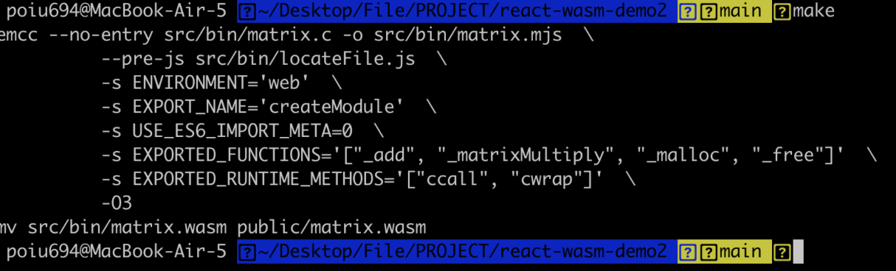
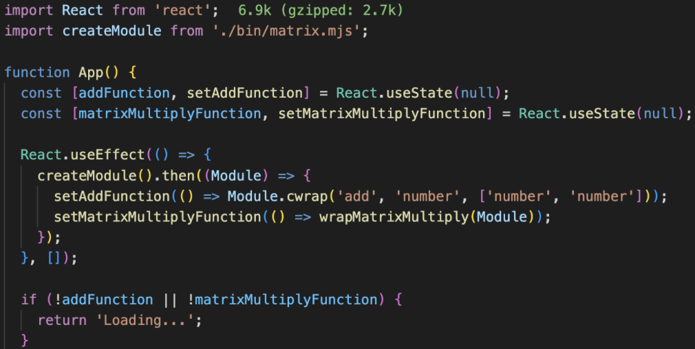

# WebAssembly

우리는 Web Assembly에 친숙해 질 필요가 있다.

> _이상민_

## 프론트엔드 개발자는 알고리즘이 필요 없다?

_"프론트엔드에서 실질적으로 알고리즘을 사용 안한다"_

프론트엔드 개발자라면 한 번쯤 들어봤을 말이라고 생각합니다.

프론트엔드는 왜 알고리즘이 필요 없다고 하는 것일까요?

그 이유는 다음과 같다고 생각합니다.

### 알고리즘의 필요성

알고리즘은 시간복잡도라는 개념이 있고, 데이터의 양이 많을수록 사용을 해야 하는 분야입니다.

1. 프론트엔드에서는 백엔드단에서 페이지네이션해서 데이터를 받아 오는 상황이 많아서 알고리즘을 많이 사용할 필요가 없다.
2. 프론트엔드에서 무거운 연산을 할 상황이 많이 만들어지지 않는다.

이처럼 프론트엔드에서 알고리즘을 사용할 상황이 많이 만들어지지 않습니다.

### 그러면 성능은 어떻게 끌어 올리죠?

그래서 프론트엔드에서 성능 최적화라고 하면

1. 빌드 시간 단축
2. DOM이 생성되고 인터랙트할 수 있는 시간까지의 최적화

이를 말하게 됩니다.

AI가 등장하고, 웹의 생태계는 꾸준히 변화하고 있는데 정말 위의 최적화 방법만 있을까요?

---

## WebAssembly에 대해 시작

그래서 저는 WebAssembly에 대해서 알려드리려고 합니다.

### WebAssembly란 ?

- WebAssembly는 최신 웹 브라우저에서 실행할 수 있는 새로운 유형의 코드입니다.

- 네이티브에 가까운 성능으로 동작하며 컴팩트한 바이너리 포맷을 제공하는 저수준 어셈블리 언어로, C/C++, Rust 등과 같은 언어의 컴파일 타겟으로써 그런 언어로 작성된 프로그램을 웹에서 사용할 수 있게 해줍니다.

- 또한 JavaScript와 함께 실행되며 서로를 보완할 수 있도록 설계되었습니다.

해당 정의는 [mdn](https://developer.mozilla.org/ko/docs/WebAssembly)에서 가져왔습니다.

제가 생각하기에 여기서 주의깊게 봐야할 부분들은 다음과 같습니다.

## 네이티브에 가까운 성능

WebAssembly 제작진에서 발표한 논문에 의하면 대략 평균 30%정도의 성능 개선을 이루어진다고 합니다.

연산이 무거우면 무거울수록 성능이 확실하게 차이가 나기 시작합니다.

### 성능이 빠른 이유는??

- Javascript에 비해 크기가 더 작아 가져오는 시간이 더 적게 걸린다.

- JavaScript에 비해 미리 최적화되어 있으므로 파싱, 컴파일 및 최적화 시간이 덜 걸린다.

- WebAssembly는 타입 정보가 내장되어 있으므로 reoptimizing이 필요하지 않으며, 실행 시에도 개발자가 코드를 작성할 때 고려해야 할 컴파일러 꼼수가 더 적다.

- 수동으로 메모리를 관리하므로 가비지 컬렉션이 필요하지 않으며 성능이 더 일관성 있게 유지

### 실제 성능 분석 사례

[카카오 프론트엔드 테크 블로그](https://tech.kakao.com/2021/05/17/frontend-growth-08/)에서는 다음과 성능을 분석했습니다.


- 이미지 : 512 x 512, lena.jpg
- 비교 방식 : 같은 필터링 과정을 50회 반복 후 평균 값 비교
- 사용된 필터 : Gray scale, Threshold, Histogram equalize, Gaussian blur, Canny edge detection

여기서는 js에 비해 2~3배 빠른 것을 알 수 있습니다.

### Javascript와 함께 실행되며 서로를 보완

WebAssembly는 Javascript를 대체하는 것이 아니라, 같이 사용할 수 있습니다. 이는 예제에서 확인해 봅시다.

---

## 예제

demo 코드는 [github](https://github.com/poiu694/react-wasm-demo.git)에서 확인할 수 있습니다.

WebAssembly를 사용하는 과정은 다음과 같습니다.

1. C/C++, Rust 등의 코드 작성

2. WebAssembly 모듈로 컴파일

3. React 에서 모듈 불러와서 사용

### C/C++, Rust 등의 코드 작성

```c
#include <emscripten/emscripten.h>
#include <stdlib.h>

EMSCRIPTEN_KEEPALIVE float *matrixMultiply(float *arg1, float *arg2, float *result, int length)
{
    for (int i = 0; i < length * length; i++)
    {
        result[i] = 0;
    }
    for (int i = 0; i < length; i++)
    {
        for (int j = 0; j < length; j++)
        {
            for (int k = 0; k < length; k++)
            {
                result[i * length + j] += (arg1[i * length + k] * arg2[k * length + j]);
            }
        }
    }

    return (result);
}

EMSCRIPTEN_KEEPALIVE int add(int a, int b)
{
    return (a + b);
}
```

다음과 같은 코드를 준비합니다.

### WebAssembly 모듈로 컴파일



`emcc` 옵션을 사용해서 빌드를 합니다.

해당 옵션을 사용하려면 [empscripten](https://emscripten.org)에서 설치후 사용해주세요.

### React에서 모듈 불러와서 사용



이처럼 react에서 불러와서 사용하면 됩니다.

실행하면 정상적으로 작동하는 것을 볼 수 있습니다.

## References

- https://hacks.mozilla.org/2017/02/what-makes-webassembly-fast/

- https://d2.naver.com/helloworld/8257914

- https://tech.kakao.com/2021/05/17/frontend-growth-08/

- https://blog.scottlogic.com/2020/01/03/webassembly-sudoku-solver.html

- https://hacks.mozilla.org/2017/06/a-cartoon-intro-to-arraybuffers-and-sharedarraybuffers/

- https://www.webassemblygames.com/

- https://github.com/poiu694/react-wasm-demo.git
