# Streaming SSR

박상우

---

## 들어가며

Next.js 13 버전에서 큰 변경사항 중 하나는 `app/` 디렉토리를 통해 HTML Streaming을 지원한다는 점입니다. 저는 [Next.js 공식 문서의 Streaming 섹션](https://beta.nextjs.org/docs/data-fetching/streaming-and-suspense)을 읽으면서, Streaming이라는 것이 기존 SSR을 한 단계 발전시켰다는 것을 알게 되었습니다. 그렇지만 구체적으로 Streaming이 SSR 과정에서 어떻게 구현되는지 알고 싶었습니다. 그리고 React Core Team의 Dan Abramov가 작성한 Discussion([New Suspense SSR Architecture in React 18](https://github.com/reactwg/react-18/discussions/37))과 구현체들을 보고 이해하게 되었습니다. 이 글은 개인적인 견해를 더해 정리한 글이므로 잘못된 내용이 있을 수 있습니다. 정확한 내용은 하단의 레퍼런스를 참고해주세요.

## 1. 왜 필요할까?

### (1) 기존 SSR의 개념

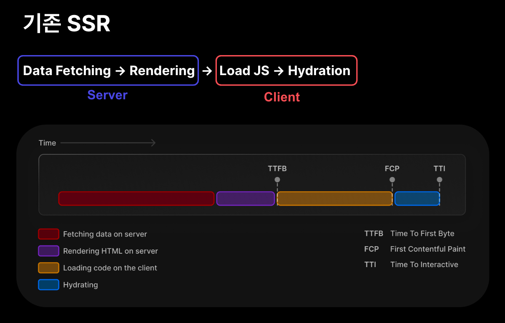

Streaming이 왜 필요한지 알기 위해선 먼저 SSR에 대해 알아야 합니다. SSR은 서버에서 먼저 렌더링이 이뤄지기 때문에 일반적으로 CSR 대비 초기 로딩 속도, SEO에서 이점이 있는 것으로 알려져 있습니다. SSR을 위해선 서버에서 클라이언트의 요청에 따라 Data Fetching과 Rendering을 통해 HTML을 생성하고 응답합니다. 그리고 HTML을 응답받은 클라이언트인 브라우저는 HTML을 파싱해 JS를 로드하고 Hydration을 진행합니다. 여기에서 응답 데이터의 바이트가 브라우저에 처음 전달된 시점을 TTFB(Time To First Byte)라고 하고, HTML을 파싱함에 따라서 FCP(First Contentful Paint), Hydration이 끝나면 TTI(Time To Interact)가 결정됩니다.

### (2) 기존 SSR의 문제

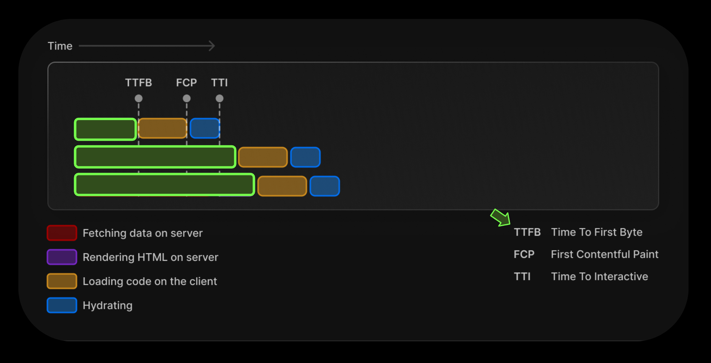

여기서 주목해야 할 것은 TTFB라는 지표입니다. 브라우저가 첫 바이트를 읽는 데 걸린 시간이 길어지면 길어질수록, FCP와 TTI가 늦어지기 때문에 사용자 경험에 좋지 않은 영향을 미칩니다. 만약 서버에서 렌더링이 지연되어서 TTFB가 계속 늦어진다면, 상황에 따라 CSR보다 FCP가 느린 상황이 연출되기도 합니다. 그래서 React에서는 이러한 문제를 Streaming으로 해결합니다.

## 2. 무엇일까?

### (1) Stream이란?

Stream이란, 시간이 지남에 따라 사용할 수 있게 되는 일련의 데이터 요소입니다. 쉽게 이해하면 서버에서 클라이언트로 데이터를 한 번에 전송하는 게 아니라, 청크를 나눠서 보내는 거라고 이해할 수 있습니다. HTML을 Streaming 한다면 위의 그림에서는 `data`가 HTML의 부분 부분이 되는 것입니다.

### (2) Streaming HTML의 시연

| 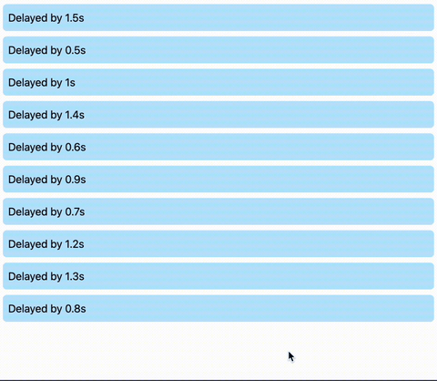 | 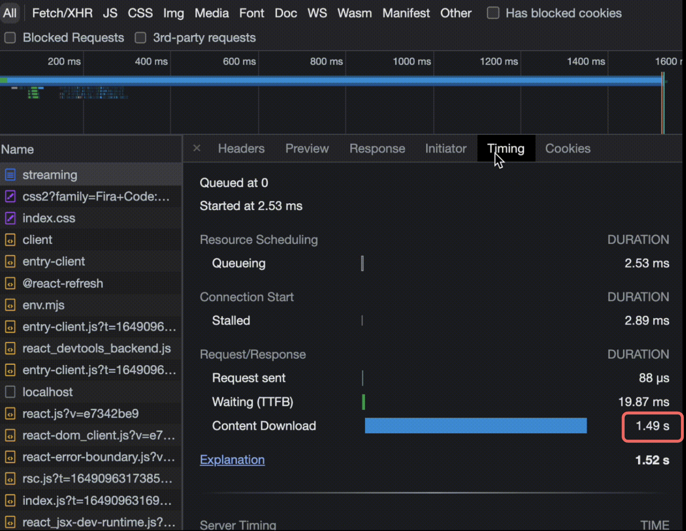 |
| ------------------------------------- | ------------------------------------- |

HTML Stream을 응답받음에 따라서 각 리스트의 색상이 하늘색으로 변하고, 해당 응답까지 몇 초가 걸렸는지 나타내고 있습니다. 맨 위에 위치한 리스트가 1.5초로 가장 오래 걸렸음을 알 수 있습니다. 또한 HTML의 응답의 waterfall을 보면 컨텐트를 다운로드하기까지 1.49초가 걸린 것을 확인할 수 있습니다. 결론적으로 HTML의 부분 부분을 stream으로 지속적으로 응답받으면서 DOM을 업데이트했다고 이해할 수 있겠습니다.

### (3) Streaming SSR이란?

Streaming SSR이란, 서버에서 HTML을 여러 Chunk로 나눠 렌더링 하고, 렌더링이 완료된 부분만 먼저 클라이언트에 응답하는 기술이라고 할 수 있습니다. 이를 통해 TTFB를 빠르게 하고, 최초 HTML을 응답받은 후에는 `<script>` 태그와 함께 스트림 형태의 추가 콘텐츠를 받을 수 있습니다.

## 3. 어떻게 동작할까?

[React Core Team의 Dan Abramov의 Demo](https://codesandbox.io/s/kind-sammet-j56ro?file=/src/App.js)를 보면서 동작을 이해해 보도록 하겠습니다.

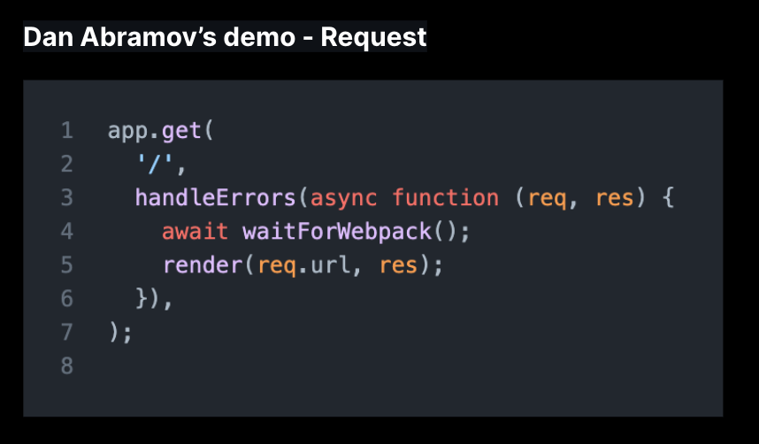

먼저 서버에서 GET 요청에 대한 기본적인 라우트를 만들고, 콜백을 정의합니다. 여기서 `waitForWebpack`은 추후에 `bootstrap`할 번들 파일을 읽기 위한 함수이고, 중요한 것은 `render` 부분입니다.

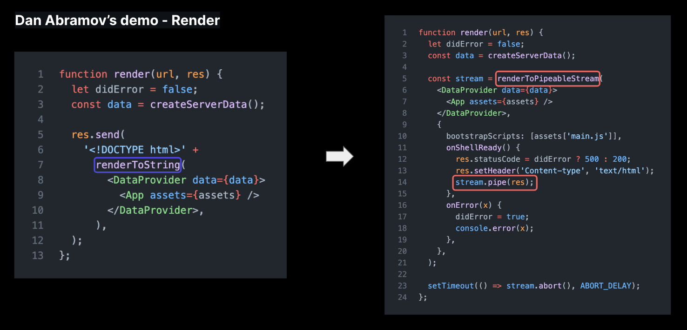

왼쪽은 stream을 사용하지 않는 버전이고, 오른쪽은 stream을 사용하는 버전입니다. 왼쪽은 `renderToString`을 사용해 ReactNode를 렌더링 해서 HTML String으로 변환하는 코드입니다. 오른쪽은 `renderToPipeableStream`을 사용해서 HTML String이 아닌 Stream으로 변환하는 코드입니다. 오른쪽 코드에서 `stream.pipe`는 `stream`으로 되어 있는 HTML의 일부분을 `res` 객체에 연결하는 역할을 합니다.

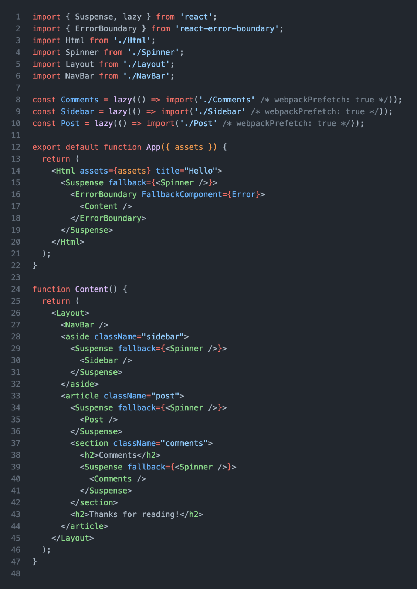

서버에서 렌더링 했던 `App` 컴포넌트의 코드입니다. React 18은 이처럼 SSR에서 `Suspense`와 `lazy`를 통해 코드 스플리팅이 가능하도록 설계되었기 때문에 점진적, 선택적 하이드레이션이 가능한 것입니다. 자세한 내용은 아래 [Discussion](https://github.com/reactwg/react-18/discussions/37)에서 확인하실 수 있습니다.

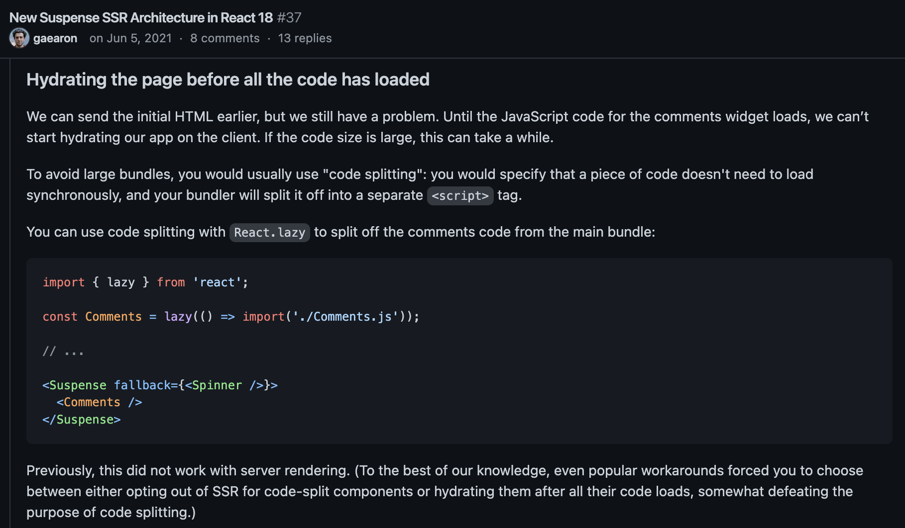

그리고 렌더링 과정에서 실행되는 `renderToPipeableStream` 메서드에서는 Suspense를 건너뛰고 현재 생성할 수 있는 Stream을 먼저 생성합니다. 만약 이전 버전의 `renderToString` 메서드를 사용한다면 모든 컴포넌트를 즉각적으로 HTML String으로 렌더링해야 하기 때문에 렌더링이 블락되는 특정 컴포넌트가 있다면 렌더링 전체의 과정이 지연되었을 것이고, 클라이언트에서 코드 스플리팅을 통한 점진적 하이드레이션도 가능하지 않았을 것입니다.

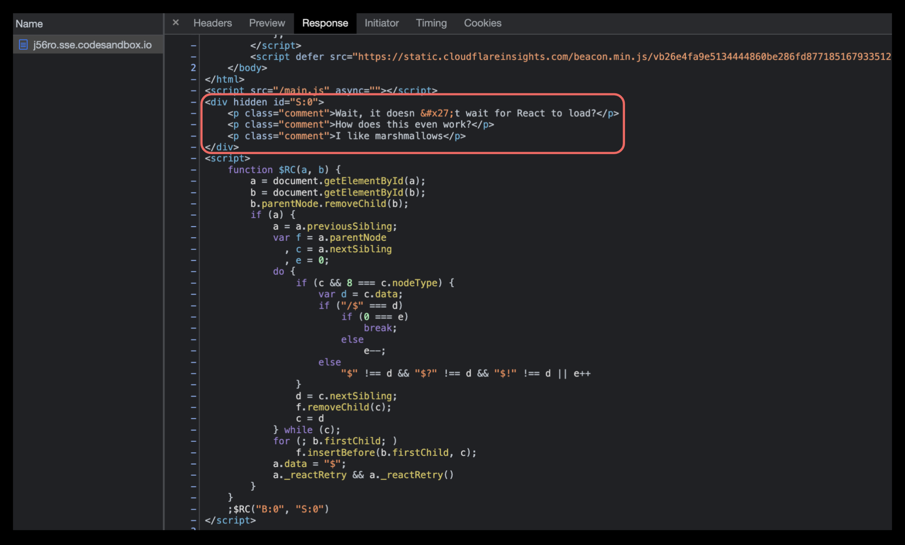

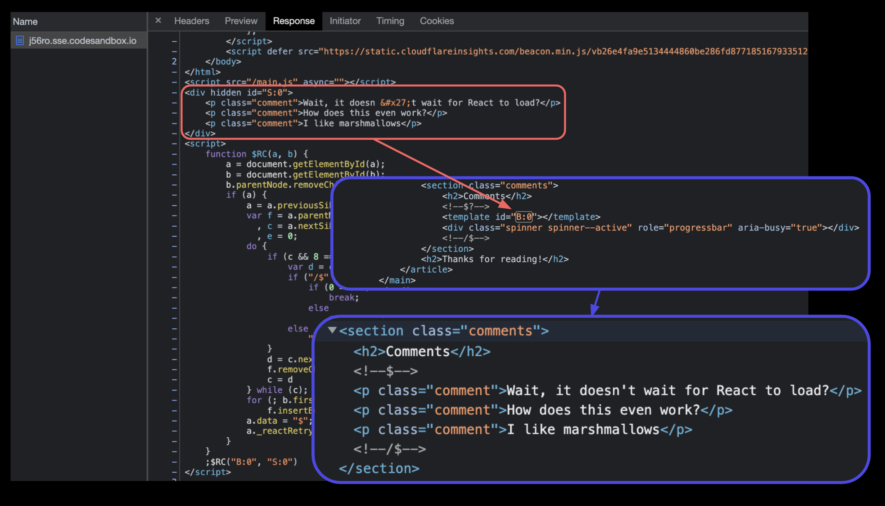

최종적으로 브라우저가 응답받은 HTML을 보면 추가 stream으로 받은 `hidden` div element가 있고, 인라인 `<script>` 태그에서는 id가 `S:0`인 요소인 `hidden` div element를 `B:0` 위치에 교체하는 명령을 실행합니다. `B:0`는 Suspense로 감쌌던 원래 위치입니다. 그러므로 뒤늦게 받은 스트림이더라도 리액트에서는 원래 위치를 알고 있기 때문에 교체만 하면 우리가 원하는 최종 결과물을 얻을 수 있게 됩니다.

## Q&A

- Streaming SSR을 하기 위해서 Next.js에서 어떤 API를 사용해야 하나요?

  - 베타 버전의 app 디렉토리를 사용하면 기본적으로 HTML을 스트리밍 합니다.

- Suspense를 함께 사용하지 않으면 어떻게 되나요?

  - 모든 스트리밍이 완료되기까지 기다리므로, 기존 SSR과 동일한 화면을 보여줍니다.

    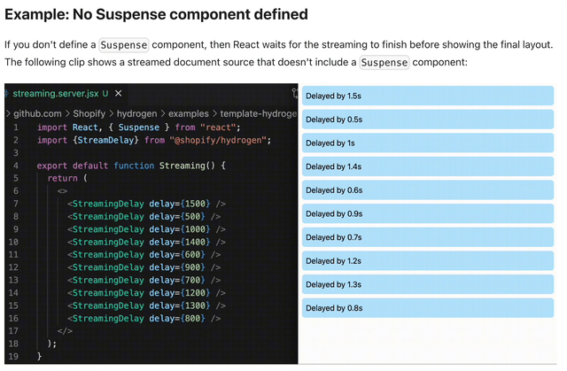

- Streaming SSR을 사용했을 때 얼마나 성능 향상을 체감했나요?

  - 이번에 처음 관심을 갖고 조사한 기술이라 아직 프로덕션에 도입하진 못했습니다. 현재는 Next.js에서 베타 기능으로 구현되어 있고, [성능 저하 이슈](https://github.com/vercel/next.js/issues/44766)가 있는 것으로 보입니다. 빠른 TTFB, 점진적 하이드레이션의 장점이 있지만, [벤치 마크](https://github.com/SuperOleg39/react-ssr-perf-test)를 보면 Streaming에 서버 리소스를 기존보다 월등히 많이 사용하는 것으로 보입니다.

## 참고

- [reactwg : New Suspense SSR Architecture in React 18](https://github.com/reactwg/react-18/discussions/37)
- [React Suspense Architecture Demo](https://codesandbox.io/s/kind-sammet-j56ro?file=/src/App.js)
- [Next.js : What is Streaming?](https://beta.nextjs.org/docs/data-fetching/streaming-and-suspense#what-is-streaming)
- [Hydrogen : Streaming server-side rendering (SSR)](https://shopify.github.io/hydrogen-v1/tutorials/streaming-ssr)
- [React API Reference : renderToPipeableStream](https://react.dev/reference/react-dom/server/renderToPipeableStream)
